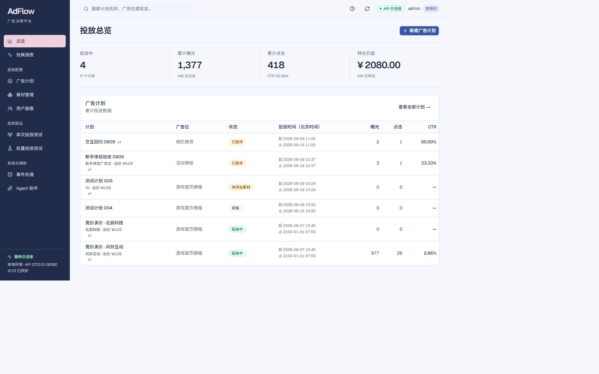
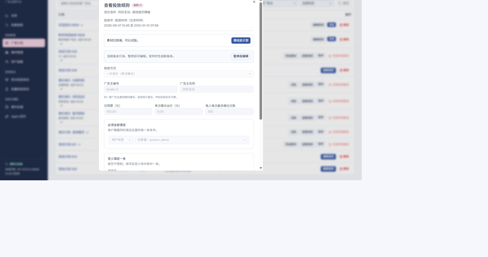
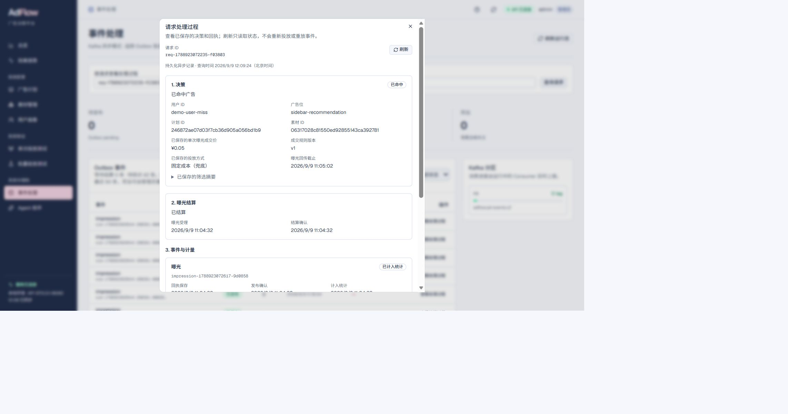
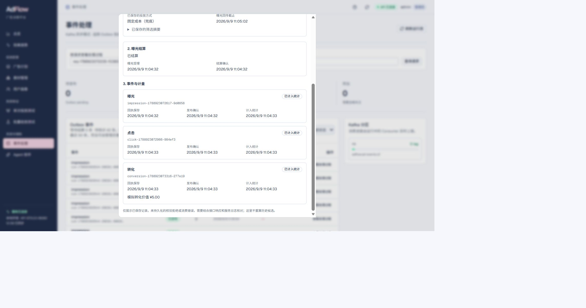
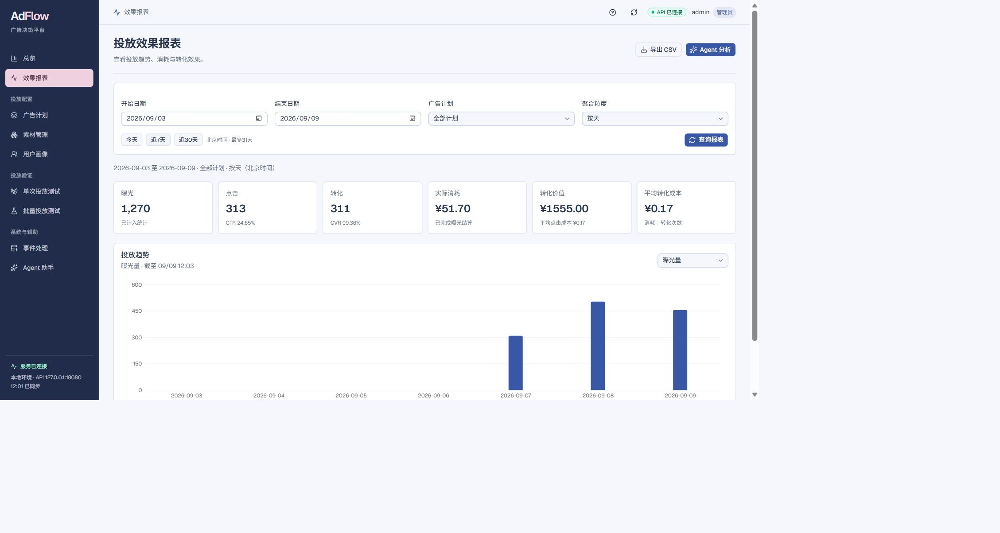
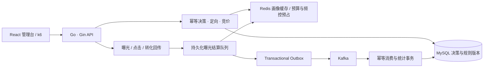

# AdFlow · 广告决策与投放验证平台

基于 **Go、MySQL、Redis、Kafka** 的后端实践项目，配有可操作的 React 管理台。从配置广告计划，到用户定向、内部竞价、预算预占、曝光结算，再到事件计量和异常排查，走通一条完整的广告投放链路。

重点是业务约束、并发正确性和可复查的压测记录，适合作为 Go 后端学习与面试展示项目。

[快速启动](#快速启动) · [五分钟演示](docs/demo-walkthrough.md) · [功能说明](docs/getting-started.md) · [版本演进](docs/project-evolution.md) · [API 文档](docs/openapi.yaml) · [性能与验证](#性能与验证)



*截图采集于 2026-09-09，来自本地运行的管理台；曝光、点击、转化价值均为模拟数据，性能结论另见下方实验记录。*

## 可以做什么

| 功能 | 说明 |
| --- | --- |
| 广告计划与素材 | 草稿、发布、暂停；不可变规则版本与乐观并发控制 |
| 定向与竞价 | 标签/字段的 all、any、none 规则；多个广告主的一价竞价，保留成交快照 |
| 预算与频控 | 整数“分”计价，决策时预占，曝光后确认；重复事件不重复扣费 |
| 用户与投放模拟 | 保存模拟画像，按计划生成样本，单次验证或固定并发批量运行 |
| 异步事件处理 | 结算队列、Transactional Outbox、Kafka 消费、幂等计量、死信与待核对 |
| 请求追踪 | 按 requestId 查看决策、曝光结算、发布和统计状态 |
| 投放效果报表 | 按小时/天、计划和日期查看趋势、实际消耗、CTR/CVR，支持 CSV 导出 |
| Agent 投放诊断 | 结合报表、计划配置与请求结果生成建议，每条建议附分析依据 |
| 权限与辅助配置 | JWT、RBAC、审计日志；Agent 生成草稿，经人工确认后发布 |

内置固定成本和三广告主竞价用例。新环境自动安装一次；用户可以编辑或删除，持久化环境重启不会恢复已删除数据。后台账号与模拟用户画像是两种不同对象。

报表与诊断均由 Go 后端实现，诊断复用现有模型调用、熔断和本地降级。MySQL 部署新增 `000014_delivery_reports` 查询索引迁移，详见 [报表与诊断说明](docs/delivery-reports-and-diagnosis.md)。

<details>
<summary>查看竞价配置、完整处理过程和效果报表</summary>

### 竞价与定向配置



### 决策 → 曝光结算 → 事件计量





### 投放效果报表



</details>

## 项目版本演进

已完成的工作按能力里程碑整理为五个版本：

| 版本 | 重点 | 代表工作 |
| --- | --- | --- |
| V1 基础投放版 | 业务闭环 | 计划、素材、画像、定向、预算频控与事件统计 |
| V2 吞吐优化版 | 降低读写开销 | 消除 N+1、候选/画像缓存、并发回源合并、Kafka 批处理 |
| V3 竞价与可靠结算版 | 并发一致性与恢复 | 一价竞价、成交快照、幂等结算、死锁重试、租约接管、联合索引 |
| V4 稳定性治理版 | 过载保护与瓶颈分析 | 队列背压、请求追踪、Prometheus、pprof、连接池对照 |
| V5 运营分析版 | 效果分析与智能辅助 | 小时/天报表、实际消耗、CSV 导出、Agent 投放诊断 |

查看[版本演进与面试讲解](docs/project-evolution.md)，了解每阶段的优化动机、实现、验证记录和面试表述。V1～V5 是项目能力里程碑，具体代码及实验来源在文档中对应。

## 技术设计



- **模块化单体**：按 campaign、decision、event、identity 等业务模块组织；领域与应用层依赖接口，MySQL、Redis、Kafka 位于适配层。
- **缓存与原子预占**：画像采用 Cache-Aside，含负缓存、并发回源合并和 generation 校验，避免旧查询重新填入过期值；Redis Lua 原子处理预算和频控。
- **并发与过载保护**：速率限制、Channel 限制执行并发、Context 超时；根据异步队列高低门槛暂停和恢复新决策，避免积压失控。
- **可靠事件链路**：先持久化受理，曝光结算确认后发布；Kafka 至少一次投递，消费端按 eventId 幂等，统计与处理记录同事务提交。
- **恢复与可解释性**：worker 租约和 owner 校验、明确回滚后的有限事务重试；保存成交版本与价格，异常进入待核对而非猜测扣费成功。

项目采用内部广告主竞价模型，不连接外部广告交易平台；广告主标识是业务归属，尚未实现广告主多租户隔离。MySQL 与 Redis 的跨存储操作不具备单事务原子性，通过预占、持久化状态和恢复流程处理失败边界。

## 性能与验证

以下是 **2026-09-08 本机实验记录**，不是生产容量承诺。测试版本、预热、负载、失败档位及原始记录保存在对应报告中；不同接口的数据不能互相替代。

| 测试对象 | 已验证结果 | 证据与边界 |
| --- | --- | --- |
| 画像查询，Redis 热缓存 | 1000 QPS，3 × 60s 通过 | [容量报告](docs/profile-capacity-20260908.md)；1500 QPS 复测未稳定通过 |
| 广告决策，含竞价与预占 | 450 QPS，3 × 60s 达标 | [决策报告](docs/decision-capacity-20260908.md)；81003 次请求有 2 次 409，不含事件回传 |
| Kafka 完整业务链路 | 45 轮/秒，3 × 120s；16202 轮、48606 条事件完成 | [完整链路](docs/kafka-capacity-followup-20260908.md)；约 180 HTTP QPS，50 轮第三组出现积压 |
| 异步积压保护 | 100 次新决策尝试/秒 × 120s，受理 6681 轮、明确拒绝 5320 次 | [保护验收](docs/async-backpressure-20260908.md)；已受理流程全部完成，统计 P95 2.875s，恢复阶段无拒绝；不代表全量接收 100 轮/秒 |
| SQL 索引对照 | 百万行 Outbox 场景，UPDATE 服务端 P95 164.52ms → 1.09ms | [独立实验](docs/sql-index-experiment-20260908.md)；同一索引 invisible/visible 对照，含回滚，非接口耗时 |

完整链路的一轮包含一次决策和曝光、点击、转化三次回传。压测同时核对受理数量、结算、消费、预算金额和重复事件；HTTP 202 或 Kafka lag=0 都不能单独代表业务已完成。

## 快速启动

需要 Go **1.27+** 和 Node.js **24**。默认使用内存适配器，可先体验功能，再接入真实基础设施。

```bash
git clone https://github.com/umi3730/AdFlow.git
cd AdFlow
go mod download
go run ./cmd/api
```

另开一个终端启动前端：

```bash
cd AdFlow/web
npm ci
npm run dev
```

打开终端显示的前端地址（默认 `http://localhost:3000`），API 默认 `http://localhost:18080`。环境变量可修改端口和适配器；程序本身不自动读取 `.env`，需要由 shell 或启动脚本加载。

首次体验建议：右上角 **功能说明 → 准备竞价演示 → 开始模拟**，先跑三轮，观察成交价和事件统计，再查看请求处理过程。各页面的用途见[第一次上手](docs/getting-started.md)。

Demo 默认直接进入管理员工作台，登录、注册和退出入口不显示，无需为访客创建账号或数据库。保持 `ADFLOW_AUTH_ENABLED=false`、`ADFLOW_REGISTRATION_ENABLED=false` 即可。详见[免登录模式](docs/direct-demo-20260908.md)。JWT、RBAC 和注册实现保留为可选功能，需要时可显式开启相应开关。

### MySQL / Redis / Kafka 模式

使用 MySQL **8.0**，先应用全部迁移（当前至 `000014`）：

```bash
go run ./cmd/migrate -dir migrations
```

通过环境配置选择 MySQL 存储、Redis 预占及 Kafka 传输，并准备对应数据库和 Topic。详见 [运行配置](docs/runtime-configuration.md)、[配置示例](.env.example) 和 [原生组件脚本](ops/native/)。Agent 默认为离线 Mock，可选配置兼容模型服务；API 密钥只放运行环境。

## 测试与目录

```bash
go test ./cmd/... ./internal/... ./tests/...
go vet ./cmd/... ./internal/... ./tests/...
cd web
npm test
npm run lint
npm run build
```

GitHub Actions 运行 Go 格式检查、vet、race 测试，以及前端格式、lint、测试和构建。真实 MySQL / Redis / Kafka 集成测试需要独立测试环境并显式启用，见[基础设施验证](docs/integration-verification.md)。

2026-09-09 已补齐本地验证：125 项前端回归、47 个有测试 Go 包的竞态检测、15 个真实依赖集成用例及 1 个报表 SQL 用例通过；记录见 [测试补跑](docs/test-completion-20260909.md)。简历引用方式见 [面试要点](docs/resume-and-interview.md)。

```text
cmd/            API 与数据库迁移入口
internal/       业务模块、基础设施适配器、可观测性
migrations/     可重复执行并校验摘要的数据库迁移
web/            React / TypeScript 管理台
tests/          集成测试、k6 / JMeter 与独立基准实验
docs/           功能设计、故障复盘、测试报告及原始证据
ops/            本地基础设施与 API 启动脚本
scripts/        性能分析与自动化工具
```

## 架构与性能

### 系统架构
- **[系统架构图](docs/architecture.md)** - 完整的模块化单体架构、组件职责和技术栈
- **[请求流程图](docs/request-flows.md)** - 决策、事件、缓存等关键路径的详细时序图

### 性能优化
- **[性能优化总览](docs/OPTIMIZATION_SUMMARY.md)** - 已完成的优化工作和基准数据
- **[性能优化指南](docs/performance-optimization.md)** - pprof 分析、连接池对照与调优边界
- **[快速开始](docs/performance-quickstart.md)** - 性能监控工具的使用方法

**已验证基准:**
- 决策 QPS: 450 (P95: 100-103ms)
- Profile 查询: 1,000 QPS (Redis 缓存)
- 完整四步链路: 45 轮/秒，三组 120s；见上方版本化测试记录

**监控能力:**
- pprof 性能分析（默认关闭，按实例配置 loopback 地址；见 [使用说明](docs/profiling.md)）
- Prometheus 指标 (包含数据库连接池监控)
- 自动化分析脚本 (`scripts/profile.ps1`)

已完成 [30/60/100 最大连接数对照](docs/mysql-pool-comparison-20260908.md)：九组试验全部通过，扩大连接数未显示稳定的整体性能收益，默认保留 30/10。未使用的对象池已移除，不计为性能成果。

### 开发检查

Windows 在仓库根目录运行 `./scripts/verify.ps1`，检查 Go 格式、静态分析、正式包测试及前端 lint/回归测试；Linux/macOS 可运行 `make verify`。Go 检查范围为 `cmd/`、`internal/`、`tests/`，避免忽略目录 `work/` 的临时实验污染结果。

`./scripts/verify.ps1 -BackendOnly` 只检查后端；`-Race` 启用竞态检测，需要可用的 C 工具链和 `CGO_ENABLED=1`。CI 保留竞态检测、前端格式检查和构建，连接 MySQL/Redis/Kafka 的集成测试需另行准备环境。工程整理内容见[代码审查记录](docs/engineering-review-20260909.md)。

[空闲连接 10/20 对照记录](docs/mysql-idle-pool-comparison-20260909.md)：观察到空闲上限触发的连接关闭减少；保留失败轮次和源码来源限制，尚不作为新的容量或已上线性能成果。

后续重点：减少结算和同步审计的数据库写入开销，补充更长依赖中断与多实例过载测试。已有边界和计划保存在 [Roadmap](docs/roadmap.md)。
